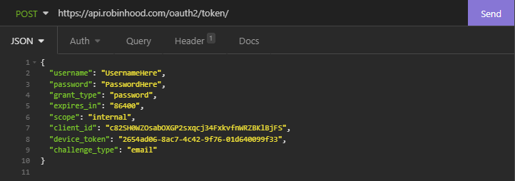
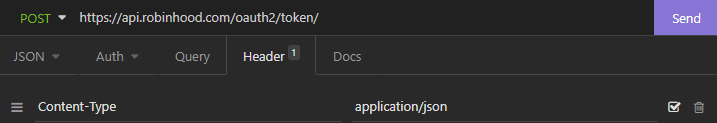
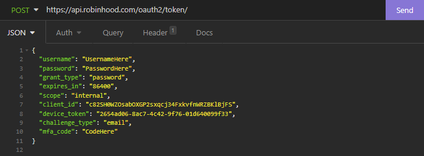
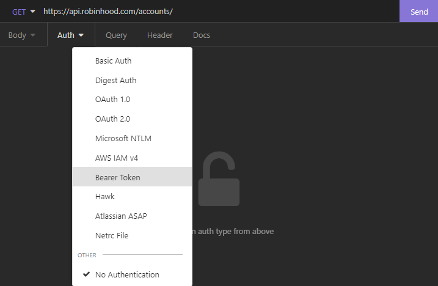
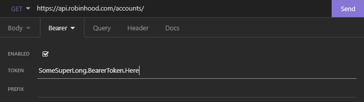

# RobinhoodTerminal

This is the Robinhood Terminal built in Kotlin using unofficial Robinhood APIs.

Here is my [Robinhood referral link](https://join.robinhood.com/nimishu) to get your free stock if you sign up using the link

## Quick start:
### IDE
Just run it

### Mac
Run this command to build the jar
  ```
  ./gradlew build
  ```
Run this command everytime you want to start the app
  ```
  java -jar .\build\libs\RobinhoodTerminal-1.0-SNAPSHOT-standalone.jar
  ```

### Windows
Run this command to build the jar
  ```
  ./gradlew.bat build
  ```
  Run this command everytime you want to start the app
  ```
  java -jar .\build\libs\RobinhoodTerminal-1.0-SNAPSHOT-standalone.jar
  ```

### Current Actions:

| Command            | Description                                           |
|--------------------|-------------------------------------------------------|
| h                  | get list of all actions                               |
| b                  | buy shares (market and limit orders)                  |
| s                  | sell shares (market and limit orders)                 |
| portfolios         | view your portfolios                                  |
| positions          | view your positions                                   |
| q                  | get stock quotes                                      |
| m                  | obtain information on the markets                     |
| d                  | view your dividends                                   |
| instrument         | view instrument(stock) details (different than quote) |
| investment_profile | view your investment profile                          |
| u                  | view user info                                        |

## Login (few options to get started)
* ### No Setup (Easy)
  If you run the app right away, you will need to sign in manually through the console when prompted. If you run the app with the jar, the password input will be hidden, if you run the app in the IDE, your password will be visible.

* ### Save username and password (Still Easy)
   If you want to stop typing your username and password every time you run the app, you can insert your username and password in the `application.conf` file in the `resources` folder. If you have 2FA enabled you will still need to enter the code when prompted after starting the app.

* ### Save session info (Hard, but easy if you used Insomnia before)

  If you don't want the app calling the Login API every time, or if you don't want to store your username and password as plain text, or if you don't want to enter your 2FA code every time, you can find your session information and fill that in the `application.conf`. You can find your session info in the response after a successful Login API call. You also will need your account number, which you can find with the Accounts API.
   
  If you end up doing this method, you will not need to change anything in the username and password fields in the `application.conf`
  
  Here are some pictures to get you going in the right direction for obtaining all the session info (Using Insomnia):
    * #### Step 1: Login API (`https://api.robinhood.com/oauth2/token/`)
 
      
         
      Make sure you add a `Content-Type` header with the value `application/json`
      
    
    * #### Step 1.5 (Do this if you have 2FA): Login with 2FA after you get your code (`https://api.robinhood.com/oauth2/token/`)

      

      Make sure you add a `Content-Type` header with the value `application/json`
      

      * Output from successful Login API call:
        ```
        {
            "access_token": "SomeSuperLong.BearerToken.Here",
            "expires_in": 353195,
            "token_type": "Bearer",
            "scope": "internal",
            "refresh_token": "SomeRefreshTokenHere",
            "mfa_code": "696969",
            "backup_code": null
        }
        ```
      Save the values of `access_token`, `expires_in`, `refresh_token` into the `application.conf` as `accessToken`, `expiresIn`, `refreshToken`

    * #### Step 2 Use the Accounts API to obtain the account number (`https://api.robinhood.com/accounts/`)
      Go to auth tab and select bearer token

      
   
      Insert Bearer Token from Login response here

      
      
      * Output from successful Accounts API call:
        ```
        {
            "next": null,
            "previous": null,
            "results": [
                {
                    "url": "https:\/\/api.robinhood.com\/accounts\/XXXXXXXX\/",
                     ...
                     ...
                }
            ]
        }
        ```
        Save your value of `XXXXXXXX` into `account` in the `application.conf`.
    
    Now every time you run the app, it will launch right away without having to go through the login or 2FA process

## Disclaimer
I am not responsible for anything that happens to your Robinhood account, use this app at your own discretion.

This app isn't endorsed, sponsored, or associated in any way with the official Robinhood app or company.
